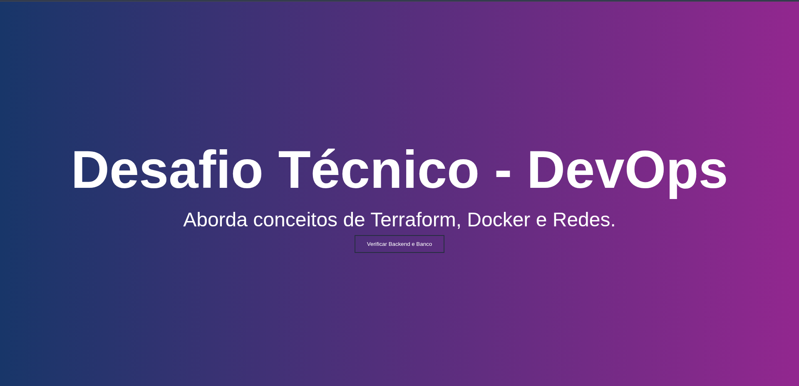

# Desafio Técnico - Cubos DevOps

Este projeto tem como objetivo criar um ambiente seguro e replicável para uma aplicação web que se comunica com um backend, o qual, por sua vez, interage com um banco de dados PostgreSQL. A infraestrutura é definida como código utilizando Terraform e os serviços são orquestrados em contêineres Docker, aplicando conceitos de Proxy Reverso, Redes Internas e Externas, Volumes e Variáveis de Ambiente.

## Sumário
- [Requisitos e Dependências](#requisitos-e-dependências)
- [Arquitetura e Componentes - Ambiente Local](#arquitetura-e-componentes---ambiente-local)
- [Execução do Projeto](#execução-do-projeto)
    - [Passo 1. Inicialização do Terraform](#passo-1-inicialização-do-terraform)
    - [Passo 2. Verificar o Plano de Execução do Terraform](#passo-2-verificar-o-plano-de-execução-do-terraform)
    - [Passo 3. Aplicação da Infraestrutura](#passo-3-aplicação-da-infraestrutura)
    - [Passo 4. Verificação](#passo-4-verificação)
    - [Passo 5. Acesse a aplicação](#passo-5-acesse-a-aplicação)
    - [Passo 6. Testar a aplicação](#passo-6-testar-a-aplicação)
- [Limpeza do Ambiente](#limpeza-do-ambiente)
- [SAST - Static Application Security Testing](#sast---static-application-security-testing)

# Requisitos e Dependências

Para a execução correta do projeto é necessário que tenhamos as seguintes tecnologias instaladas e configuradas no ambiente.

- Docker: Necessário para construir as imagens das aplicações e executar os containers.
- Terraform: Utilizado para definir e orquestar a infraestrutura como código (Iac).

> Nota: Todos os componentes foram configurados para rodar localmente.

# Arquitetura e Componentes

A arquitetura do projeto foi projetada da seguinte forma.

Todas as variáveis de ambiente foram definidas nos arquivos do Terraform (`variables.tf` e `terraform.tfvars`).

## Web Application (Frontend) - NGINX (Proxy Reverso)

O serviço de frontend é implementado utilizando uma imagem customizada do Nginx, que serve o *index.html* na rota principal.

O Nginx atua como Proxy Reverso, redirecionando as requisições que chegam na rota **/api** para o container do Backend.

## Backend - Aplicação NODE.js

A aplicação backend em Node.js (JavaScript) é responsável pela lógica de negócios e interação com o banco de dados.

O backend recebe todas as requisições **/api** do Proxy e faz a comunicação com o Database.

## Database - PostgreSQL 15.8

O banco de dados utilizado no desafio é o **PostgreSQL 15.8**. Para garantir a **persistência dos dados**, foi configurado um **volume externo do Docker**, assegurando que as informações sejam mantidas mesmo em caso de falhas ou reinicializações dos contêineres.

O acesso ao banco é restrito aos contêineres que pertencem à **rede interna**, ou seja, apenas o contêiner do backend pode se comunicar diretamente com o PostgreSQL.

### Inicialização e Segurança do Banco
O script de inicialização do banco (script.sql) foi substituído por um Shell Script (init-db.sh). As principais razões foram:

- Princípio do Mínimo Privilégio: Criação de um usuário para a aplicação (app_desafio_cubos) com permissões restritas, garantindo que o Backend não utilize o superusuário (postgres). 

- Segurança de Credenciais: O uso do script Shell permite a injeção de Variáveis de Ambiente para as credenciais, garantindo que senhas confidenciais não sejam passadas em texto puro no script de inicialização.

# Execução do Projeto

Para inicializar o ambiente, siga os passos abaixo. O ambiente completo é construído utilizando Terraform, que orquestra os contêineres e suas conexões.

## Passo 1. Inicialização do Terraform

Use o comando para inicializar o terraform, baixando os providers que ele precisa para executar o código.

```bash
terraform init
```

## Passo 2. Verificar o Plano de Execução do Terraform

Use o comando para verificar o plano de execução do terraform.

```bash
terraform plan
```

## Passo 3. Aplicação da Infraestrutura


```bash
terraform apply
```

Digite `yes` para confirmar.

## Passo 4. Verificação

Verifique se todos os contêineres estão em execução. A saída deve ser semelhante a esta:

```
CONTAINER ID   IMAGE          COMMAND                  CREATED          STATUS          PORTS                NAMES
62c5b42d3791   6cdef628006d   "/usr/bin/node index…"   33 minutes ago   Up 33 minutes   3000/tcp             backend
a3251a18c446   71e0fabbbff0   "docker-entrypoint.s…"   33 minutes ago   Up 33 minutes   5432/tcp             database
5303def7ac7f   4100f7fa8c0d   "/docker-entrypoint.…"   38 minutes ago   Up 38 minutes   0.0.0.0:80->80/tcp   web-application
```

Podem existir pequenas variações nos campos **CREATED**, **STATUS** e **CONTAINER ID**.

## Passo 5. Acesse a aplicação

A aplicação Frontend estará acessível através do Nginx na porta 80.



## Passo 6. Testar a aplicação

Clicando no botão **Verificar Backend e Banco** podemos ver que está tudo normal.


# Limpeza do Ambiente

Para encerrar e remover todos os recursos de infraestrutura criados pelo Terraform, execute:

```bash
terraform destroy
```

Digite `yes` para confirmar.

# SAST - Static Application Security Testing

Para verificar possíveis vulnerabilidades nas imagens Docker, utilizei a ferramenta [Trivy](https://github.com/aquasecurity/trivy), uma solução de *Static Application Security Testing (SAST)* que analisa imagens, arquivos de configuração e dependências em busca de falhas conhecidas.

Abaixo está um resumo da saída do comando:

```bash
2025-10-25T16:58:08-03:00       INFO    Number of language-specific files       num=0
2025-10-25T16:58:08-03:00       INFO    Detected config files   num=4

Report Summary

┌─────────────────────┬────────────┬─────────────────┬─────────┬───────────────────┐
│       Target        │    Type    │ Vulnerabilities │ Secrets │ Misconfigurations │
├─────────────────────┼────────────┼─────────────────┼─────────┼───────────────────┤
│ .                   │ terraform  │        -        │    -    │         0         │
├─────────────────────┼────────────┼─────────────────┼─────────┼───────────────────┤
│ backend/Dockerfile  │ dockerfile │        -        │    -    │         1         │
├─────────────────────┼────────────┼─────────────────┼─────────┼───────────────────┤
│ frontend/Dockerfile │ dockerfile │        -        │    -    │         1         │
├─────────────────────┼────────────┼─────────────────┼─────────┼───────────────────┤
│ sql/Dockerfile      │ dockerfile │        -        │    -    │         1         │
└─────────────────────┴────────────┴─────────────────┴─────────┴───────────────────┘
Legend:
- '-': Not scanned
- '0': Clean (no security findings detected)


backend/Dockerfile (dockerfile)

Tests: 27 (SUCCESSES: 26, FAILURES: 1)
Failures: 1 (UNKNOWN: 0, LOW: 1, MEDIUM: 0, HIGH: 0, CRITICAL: 0)

AVD-DS-0026 (LOW): Add HEALTHCHECK instruction in your Dockerfile
═══════════════════════════════════════════════════════════════════════════════════════════════════════════════════════════════
You should add HEALTHCHECK instruction in your docker container images to perform the health check on running containers.

See https://avd.aquasec.com/misconfig/ds026
───────────────────────────────────────────────────────────────────────────────────────────────────────────────────────────────


frontend/Dockerfile (dockerfile)

Tests: 27 (SUCCESSES: 26, FAILURES: 1)
Failures: 1 (UNKNOWN: 0, LOW: 1, MEDIUM: 0, HIGH: 0, CRITICAL: 0)

AVD-DS-0026 (LOW): Add HEALTHCHECK instruction in your Dockerfile
═══════════════════════════════════════════════════════════════════════════════════════════════════════════════════════════════
You should add HEALTHCHECK instruction in your docker container images to perform the health check on running containers.

See https://avd.aquasec.com/misconfig/ds026
───────────────────────────────────────────────────────────────────────────────────────────────────────────────────────────────


sql/Dockerfile (dockerfile)

Tests: 27 (SUCCESSES: 26, FAILURES: 1)
Failures: 1 (UNKNOWN: 0, LOW: 1, MEDIUM: 0, HIGH: 0, CRITICAL: 0)

AVD-DS-0026 (LOW): Add HEALTHCHECK instruction in your Dockerfile
═══════════════════════════════════════════════════════════════════════════════════════════════════════════════════════════════
You should add HEALTHCHECK instruction in your docker container images to perform the health check on running containers.

See https://avd.aquasec.com/misconfig/ds026
───────────────────────────────────────────────────────────────────────────────────────────────────────────────────────────────
```

O Trivy identificou apenas uma recomendação de baixo impacto (LOW) em todos os Dockerfiles, relacionada à ausência da instrução HEALTHCHECK.

No momento, optei por não adicionar a instrução HEALTHCHECK, pois a configuração de monitoramento pode variar conforme o ambiente, HEALTHCHECK (no Docker) ou Probes (liveness, readiness, startup) no Kubernetes.
